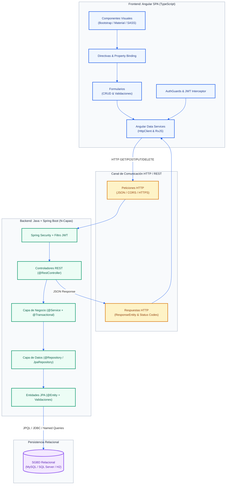
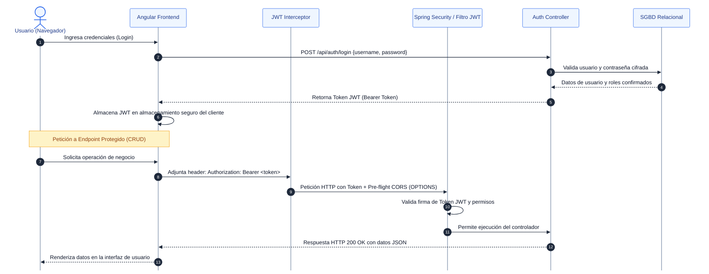

# AGENTS.md — Especificación Canónica y Lista Blanca Técnica del Sistema

|Parámetro|Detalle|
|-|-|
|**Curso \& Código**|Soluciones Web y Aplicaciones Distribuidas (SIST1402A) — 3 Créditos — Ciclo 8° / 9°|
|**Institución \& Periodo**|Universidad Privada del Norte (UPN) — Facultad de Ingeniería — Periodo 2026-2|
|**Docente de Cátedra**|Ing. Mg. Carlos Alberto Ponte Ramírez|
|**Alineación Estratégica**|ODS 09: Industria, Innovación e Infraestructura|
|**Audiencia**|Google Jules, Antigravity CLI, Agentes Autónomos y Desarrolladores|

\---

## 1\. Reglas Mandatarias de Ingeniería y Lista Blanca Estricta

1. **Lista Blanca Tecnológica Absoluta:** Queda terminantemente prohibido utilizar lenguajes, frameworks, librerías, dependencias en `pom.xml`/`package.json`, etiquetas, anotaciones o prácticas de programación distintas a las enseñadas en las diapositivas y guías de laboratorio del curso. Cualquier elemento fuera de esta lista blanca será rechazado.
2. **Respeto a la Progresión Didáctica por Semanas:**

   * **Semana 01:** Spring Web básico, MVC (Modelo-Servicio-Controlador), Thymeleaf vs REST JSON.
   * **Semana 02:** Endpoints GET/POST con almacenamiento en memoria (`List<T>`), sin base de datos.
   * **Semana 03:** Persistencia manual con `EntityManager` y clase `@Repository` (MySQL / SQL Server / H2). **Prohibido usar `JpaRepository` en esta semana**.
   * **Semana 04:** Recién se autoriza `JpaRepository`, CRUD completo (PUT, DELETE), consultas JPQL con parámetros (`@Query`, `@Param`), `@NamedQuery` y `@Transient`. Prohibida la concatenación de strings en consultas.
   * **Semana 05:** Recién se autorizan Bean Validation (`spring-boot-starter-validation`), Spring Security (`spring-boot-starter-security`), JWT y control CORS.
   * **Semana 07:** Recién se introduce la Single Page Application (SPA) con Angular CLI.
3. **Cero Mocks Ciegos:** Todos los componentes deben ser 100% deterministas y funcionales.
4. **Trazabilidad Obligatoria:** Todo commit, issue o PR debe referenciar su código funcional (ej. `\[RF-SEM04-02]`).
5. **Respeto a Hitos Académicos:** Evolución incremental según el calendario: T1 (Sem 6), T2 (Sem 10), T3 (Sem 13) y Final (Sem 16).

\---

## 2\. Pila Tecnológica Oficial y Lista Blanca de Dependencias

### 2.1. Dominio Tecnológico Autorizado

Ninguna tecnología, framework, librería, dependencia, anotación o práctica de programación que no esté explícitamente autorizada en este documento está permitida para su uso en la solución web.

|Capa / Dominio|Tecnologías Oficiales Autorizadas por el Sílabo y Laboratorios|
|-|-|
|**Backend**|Java (JDK 17 LTS / JDK 20), Spring Boot (versión estable Spring Initializr), Maven con Maven Wrapper (`./mvnw`).|
|**Persistencia / BD**|MySQL Server 8.x (puerto 3306), Microsoft SQL Server (puerto 1433), H2 Database (en memoria), JPA, Hibernate, `EntityManager`, `@Repository`, `JpaRepository`, JPQL parametrizado, `@Transactional`.|
|**Frontend**|Angular (TypeScript, Angular CLI `ng`), Componentes, Directivas, Data Binding, Services, `HttpClient`, Routing, Query Params, Reactive Forms, Interceptores JWT, Route Guards.|
|**Diseño / Estilos**|Bootstrap 5, Material Design (`@angular/material`), SASS/SCSS (`styles.scss`), CSS3 Flexbox y CSS Grid. *(Thymeleaf y HTML/CSS para vistas de servidor)*.|
|**APIs y Protocolos**|RESTful APIs (JSON, HTTP GET/POST/PUT/DELETE, `ResponseEntity`), Servicios SOAP (WSDL/XML para interoperabilidad y contraste), CORS.|
|**Documentación API**|Swagger / OpenAPI 3 (`springdoc-openapi-starter-webmvc-ui` en `/swagger-ui/index.html`).|
|**Servidores / Despliegue**|Apache Tomcat (embebido en puerto 8080/8081 o standalone), Red Hat WildFly, Oracle WebLogic Server, Certificados SSL/TLS (HTTPS).|
|**Gestión de Proyectos**|Metodología Tradicional (PMI) y Metodologías Ágiles (Scrum: Backlog, Sprints, Criterios de Aceptación).|

### 2.2. Lista Blanca de Dependencias Maven (`pom.xml`)

* `org.springframework.boot:spring-boot-starter-web` (Spring MVC, REST, Jackson)
* `org.springframework.boot:spring-boot-starter-thymeleaf` (Vistas de servidor en `resources/templates/`)
* `org.springframework.boot:spring-boot-devtools` (Recarga en caliente para desarrollo)
* `org.springframework.boot:spring-boot-starter-data-jpa` (Hibernate, JPA, EntityManager)
* `com.h2database:h2` (Base de datos en memoria para pruebas locales)
* `com.mysql:mysql-connector-j` (Driver oficial para MySQL Server)
* `com.microsoft.sqlserver:mssql-jdbc` (Driver oficial para SQL Server)
* `org.springframework.boot:spring-boot-starter-validation` (Bean Validation API)
* `org.springframework.boot:spring-boot-starter-security` (Filtros de seguridad y autenticación)
* `io.jsonwebtoken:jjwt-api`, `jjwt-impl`, `jjwt-jackson` (Emisión y validación de tokens JWT)
* `org.springdoc:springdoc-openapi-starter-webmvc-ui` (Swagger UI interactivo)
* `org.projectlombok:lombok` (Generación de getters/setters/constructores)

### 2.3. Lista Blanca de Anotaciones Backend Permitidas

* **Configuración \& Inicio:** `@SpringBootApplication`, `@Configuration`, `@Bean`.
* **Controladores Web/REST:** `@RestController`, `@Controller`, `@RequestMapping`, `@CrossOrigin(origins = "\*")`, `@GetMapping`, `@PostMapping`, `@PutMapping`, `@DeleteMapping`, `@PathVariable`, `@RequestParam`, `@RequestBody`.
* **Manejo Global de Errores:** `@RestControllerAdvice`, `@ControllerAdvice`, `@ExceptionHandler`.
* **Servicios \& Transacciones:** `@Service`, `@Transactional(rollbackFor = Exception.class)`.
* **Persistencia \& Entidades:** `@Repository`, `@PersistenceContext`, `@Entity`, `@Table(name = "...")`, `@Id`, `@GeneratedValue(strategy = GenerationType.IDENTITY)`, `@Column`, `@Transient`, `@Query`, `@Param`, `@NamedQuery`, `@Modifying`.
* **Validación de Datos:** `@Valid`, `@NotNull`, `@NotBlank`, `@NotEmpty`, `@Size`, `@Min`, `@Max`, `@Email`.

### 2.4. Comandos y Módulos Oficiales de Angular CLI

* **Creación de Proyecto:** `ng new <nombre-frontend> --routing --style=scss`
* **Generación de Artefactos:** `ng g c components/<nombre>`, `ng g s services/<nombre>`, `ng g guard guards/<nombre>`
* **Módulos Core:** `HttpClientModule` (o `provideHttpClient()`), `ReactiveFormsModule`, `FormsModule`, `RouterModule` (`Routes`, `router-outlet`, `routerLink`, `ActivatedRoute`), RxJS (`Observable`, `Subject`, `BehaviorSubject`, `pipe`, `map`, `catchError`).
* **Ejecución y Compilación:** `ng serve -o` (puerto 4200), `ng test --watch=false`, `ng build --configuration production`.

\---

## 3\. Arquitectura del Sistema

### 3.1. Arquitectura Lógica N-Capas y Flujo de Integración

> **Archivos generados:** [arquitectura_n_capas.svg](arquitectura_n_capas.svg) (Vectorial SVG) | [arquitectura_n_capas.png](arquitectura_n_capas.png) (Alta resolución para Microsoft Fotos) | [arquitectura_n_capas.mmd](arquitectura_n_capas.mmd) (Fuente Mermaid)



### 3.2. Flujo de Autenticación Stateless con JWT y CORS

> **Archivos generados:** [autenticacion_jwt_cors.svg](autenticacion_jwt_cors.svg) (Vectorial SVG) | [autenticacion_jwt_cors.png](autenticacion_jwt_cors.png) (Alta resolución para Microsoft Fotos) | [autenticacion_jwt_cors.mmd](autenticacion_jwt_cors.mmd) (Fuente Mermaid)



\---

## 4\. Requerimientos Funcionales y Especificaciones Técnicas por Unidad

> Cada una de las 16 semanas cuenta con su ficha técnica local (`sem XX/requerimientos\_semana\_XX.txt`). A continuación, se sintetizan todos los requerimientos funcionales (`RF-SEM01-01` a `RF-SEM16-01`) y especificaciones técnicas (`SPEC-SEM01` a `SPEC-SEM16`) de forma canónica, estructurada y minimalista:

### Unidad I: Introducción al Desarrollo Web, Procesos y Backend Inicial (Semanas 01 - 02)

|Sem / Código|Requerimiento Funcional y Alcance|Pila Técnica y Especificaciones de Clase|Criterio de Aceptación Determinista|
|:-:|-|-|-|
|**S01**<br>`RF-SEM01-01`<br>`SPEC-SEM01-A`|**Arquitectura Web y Configuración Backend Inicial:** Crear base Spring Boot cliente-servidor en N-capas (`controller`, `service`, `model`).|Spring Initializr (`start.spring.io`), Java 17 LTS, Maven Wrapper (`./mvnw`), `spring-boot-starter-web`, `spring-boot-devtools`. Group: `pe.upn.sist1402a`.|Compila con `./mvnw clean compile`, levanta en Tomcat puerto 8080 (`server.port=8080`). Endpoint `/api/saludo` responde `Backend activo`.|
|**S01**<br>`RF-SEM01-02`<br>`SPEC-SEM01-B`|**Vistas Tradicionales vs. REST Desacoplado:** Contrastar renderizado server-side HTML frente a API REST JSON.|`spring-boot-starter-thymeleaf`. Anotaciones: `@Controller` (devuelve vista `resources/templates/pacientes.html`) vs `@RestController` (devuelve JSON).|Se evidencia la diferencia: `@Controller` procesa plantilla con variables del modelo; `@RestController` emite JSON puro.|
|**S02**<br>`RF-SEM02-01`<br>`SPEC-SEM02-A`|**Modelado de Procesos de Negocio:** Delimitar flujos operativos y casos de uso del caso del curso.|Caso Posta Médica / Anemia (Virú) o Almacén de Productos. Entidad `Paciente` o `Producto`.|Casos de uso y especificación formal de requerimientos documentados.|
|**S02**<br>`RF-SEM02-02`<br>`SPEC-SEM02-B`|**Patrones GoF en Backend:** Implementar Singleton (Spring Services), Factory, Decorador y Repository (abstracción).|Java POO, Patrones GoF, `@Service`, separación estricta controller-service-model.|Separación de responsabilidades clara sin acoplamiento; servicios coordinan lógica de negocio.|
|**S02**<br>`RF-SEM02-03`<br>`SPEC-SEM02-C`|**Endpoints GET y POST en Memoria con Seguridad Básica:** Gestión de productos/pacientes sin base de datos aún.|`spring-boot-starter-web`. Anotaciones: `@RestController`, `@RequestMapping("/api/productos")`, `@CrossOrigin(origins = "\*")`, `@GetMapping`, `@PostMapping`, `@RequestBody`, `@PathVariable`.|Endpoints operan con `List<T>` en memoria (`filter`, `findFirst`), retornando `ResponseEntity.ok()`, `201 Created` y `404 Not Found`.|

\---

### Unidad II: Backend con Spring Boot, Persistencia y Gestión del Proyecto (Semanas 03 - 06)

|Sem / Código|Requerimiento Funcional y Alcance|Pila Técnica y Especificaciones de Clase|Criterio de Aceptación Determinista|
|:-:|-|-|-|
|**S03**<br>`RF-SEM03-01`<br>`SPEC-SEM03-A`|**Diseño Técnico API REST bajo Enfoque PMI:** Fundamentar la API con alcance, EDT/WBS y contratos técnicos.|PMI / PMBOK, REST API Design. Criterio de aceptación: datos sobreviven al reinicio de la app.|Matriz de trazabilidad entre entregables EDT y firmas de endpoints.|
|**S03**<br>`RF-SEM03-02`<br>`SPEC-SEM03-B`|**Persistencia JPA con EntityManager (Regla: Sin JpaRepository):** Conexión relacional y mapeo de entidades.|`spring-boot-starter-data-jpa`, `mysql-connector-j` (o `mssql-jdbc`/`h2`). Anotaciones: `@Entity`, `@Table`, `@Id`, `@GeneratedValue(strategy = GenerationType.IDENTITY)`, `@Column`. Clase `@Repository` con `@PersistenceContext EntityManager entityManager`.|**Prohibido JpaRepository en S03**. Inserción con `entityManager.persist()` y consulta con `entityManager.createQuery()`. Configuración en `application.properties`.|
|**S04**<br>`RF-SEM04-01`<br>`SPEC-SEM04-A`|**Gestión Ágil (Scrum):** Product Backlog de incremento (historias HU-01 a HU-07), Sprints y criterios DoD.|Metodologías Ágiles, Scrum, User Stories con Criterios de Aceptación verificables.|Backlog estructurado con tareas asignadas y criterios de aceptación claros.|
|**S04**<br>`RF-SEM04-02`<br>`SPEC-SEM04-B`|**CRUD Integral con JpaRepository:** Operaciones completas de lectura, creación, edición y borrado.|`public interface ProductoRepository extends JpaRepository<Producto, Long>`. Métodos derivados (`findByNombreContainingIgnoreCase`).|Métodos CRUD (`findAll`, `findById`, `save`, `deleteById`, `existsById`) operan sobre base de datos MySQL/SQL Server.|
|**S04**<br>`RF-SEM04-03`<br>`SPEC-SEM04-C`|**JPQL Parametrizado, Named Queries y Mitigación SQLi:** Consultas seguras y campos calculados.|`@Query("SELECT p FROM Producto p WHERE p.precio BETWEEN :minimo AND :maximo")`, `@Param`, `@NamedQuery`, `@Transient`.|**Prohibida concatenación de cadenas en JPQL**. Uso obligatorio de parámetros enlazados `:param`. `@Transient` en `estadoStock`.|
|**S05**<br>`RF-SEM05-01`<br>`SPEC-SEM05-A`|**Endpoints REST Estandarizados y Validación Backend:** Controladores show, create, update, delete con validaciones.|`spring-boot-starter-validation`. Anotaciones: `@Valid`, `@NotBlank`, `@NotNull`, `@Size`, `@Min`, `@Max`. Manejo de excepciones con `@RestControllerAdvice`.|Validación automática de campos; respuestas estructuradas: 200 OK, 201 Created, 204 No Content, 400 Bad Request con mensaje claro.|
|**S05**<br>`RF-SEM05-02`<br>`SPEC-SEM05-B`|**Seguridad con Spring Security y JWT:** Emisión y validación stateless de tokens de autenticación.|`spring-boot-starter-security`, JJWT / Nimbus. Ruta pública `/api/auth/login`; recursos protegidos con cabecera `Authorization: Bearer <token>`.|Peticiones no autorizadas retornan 401 Unauthorized / 403 Forbidden; tokens válidos permiten acceso al CRUD.|
|**S05**<br>`RF-SEM05-03`<br>`SPEC-SEM05-C`|**Control de Políticas CORS para Angular:** Habilitar consumo seguro desde el cliente SPA.|Spring Security CORS (`@CrossOrigin(origins = "http://localhost:4200")` o `CorsConfigurationSource`).|Pre-flight `OPTIONS` exitoso admitiendo verbos HTTP y encabezados `Authorization`, `Content-Type`.|
|**S06**<br>`RF-SEM06-01`<br>`SPEC-SEM06-A`|**Consolidación Backend — Evaluación T1 (10%):** Integración completa de API REST, JPA, validaciones y pruebas.|Spring Boot, Spring Data JPA, Spring Security, cURL / Postman (`curl.exe -i http://localhost:8080/api/...`).|Casos de prueba ejecutados satisfactoriamente con persistencia real y seguridad demostrada.|
|**S06**<br>`RF-SEM06-02`<br>`SPEC-SEM06-B`|**Alineación con ODS 9:** Documentar automatización e infraestructura sostenible.|ODS 09 (Naciones Unidas). Caso: Sistema de salud/posta médica o eficiencia de inventarios.|Evidencia técnica que justifica la automatización de procesos y optimización de recursos.|

\---

### Unidad III: Front-end Angular e Integración con API REST (Semanas 07 - 11)

|Sem / Código|Requerimiento Funcional y Alcance|Pila Técnica y Especificaciones de Clase|Criterio de Aceptación Determinista|
|:-:|-|-|-|
|**S07**<br>`RF-SEM07-01`<br>`SPEC-SEM07-A`|**Estructura SPA y Componentes en Angular:** Crear aplicación frontend modular mediante Angular CLI.|`ng new <frontend> --routing --style=scss`, `ng g c components/<nombre>`. Node.js, npm, Angular CLI.|Aplicación inicializa con `ng serve -o` en puerto 4200 sin errores de consola; estructura modular de vistas.|
|**S07**<br>`RF-SEM07-02`<br>`SPEC-SEM07-B`|**Data Binding, Directivas y Comunicación:** Implementar interpolación, bindings y decoradores.|Interpolación `{{ }}`, property binding `\[ ]`, event binding `( )`, directivas `\*ngIf`, `\*ngFor`, `@Input()`, `@Output()`, `EventEmitter`.|Los componentes hijos reciben información y emiten eventos reactivos hacia los componentes contenedores.|
|**S07**<br>`RF-SEM07-03`<br>`SPEC-SEM07-C`|**Diseño Responsivo con Bootstrap, Material y SASS:** Maquetación moderna adaptada a múltiples pantallas.|Bootstrap 5 (`npm i bootstrap`), Angular Material (`ng add @angular/material`), SASS (`styles.scss`), Flexbox y CSS Grid.|Interfaz gráfica 100% responsiva y estética adaptada a móviles, tablets y escritorios.|
|**S08**<br>`RF-SEM08-01`<br>`SPEC-SEM08-A`|**Consumo de API REST vía Data Services:** Servicios Angular con `HttpClient` y RxJS.|`ng g s services/<nombre>`, `HttpClientModule` (o `provideHttpClient()`), RxJS `Observable<T>`, `pipe`, `catchError`.|Métodos de servicio (`listar()`, `buscarPorId()`, `crear()`) tipados estrictamente con interfaces TypeScript.|
|**S08**<br>`RF-SEM08-02`<br>`SPEC-SEM08-B`|**Routing, Query Params y Formularios Reactivos:** Navegación SPA y captura de datos con validaciones.|`RouterModule` (`app-routing.module.ts`, `Routes`, `router-outlet`), `ReactiveFormsModule` (`FormGroup`, `FormControl`, `Validators`).|Navegación fluida sin recarga de página; formularios alertan campos requeridos antes del envío.|
|**S08**<br>`RF-SEM08-03`<br>`SPEC-SEM08-C`|**Autenticación Frontend con JWT:** Almacenamiento y transporte del token de sesión.|Angular `HttpInterceptor` inyectando cabecera `Authorization: Bearer <token>`, Route Guards (`canActivate`).|Redirección a login ante accesos anónimos; inyección automática de credenciales en cada petición protegida.|
|**S08**<br>`RF-SEM08-04`<br>`SPEC-SEM08-D`|**Despliegue Inicial de Integración:** Ejecución simultánea local de cliente y servidor.|Terminal 1: `./mvnw spring-boot:run` (8080). Terminal 2: `ng serve -o` (4200).|El frontend consume endpoints reales del backend mostrando datos persistentes.|
|**S09**<br>`RF-SEM09-01`<br>`SPEC-SEM09-A`|**Integración Extremo a Extremo (E2E):** Flujo completo crear-listar-editar-eliminar.|Angular + Spring Boot API REST + MySQL / SQL Server.|Operaciones en la interfaz actualizan de forma inmediata y consistente los registros en la base de datos.|
|**S09**<br>`RF-SEM09-02`<br>`SPEC-SEM09-B`|**Manejo Robusto de Errores y Retroalimentación:** Captura de respuestas de error HTTP.|RxJS `catchError`, Angular Material SnackBar (`MatSnackBar`) o alertas Bootstrap.|Errores 400, 401, 403, 404 y 500 muestran alertas claras al usuario sin congelar la vista ni generar pantallas en blanco.|
|**S09**<br>`RF-SEM09-03`<br>`SPEC-SEM09-C`|**Documentación de Consumo y Evidencias:** Matriz de endpoints y capturas de flujo.|Markdown, capturas de pantalla, trazas de petición y respuesta.|Registro técnico con payloads, códigos HTTP de retorno y evidencias de prueba.|
|**S10**<br>`RF-SEM10-01`<br>`SPEC-SEM10-A`|**Defensa de Solución Integrada — Evaluación T2 (20%):** Sustentación de la app integrada completa.|Frontend Angular + Backend Spring Boot + JWT + CRUD completo.|Demostración en vivo de login, rutas privadas, validaciones, CRUD y persistencia.|
|**S10**<br>`RF-SEM10-02`<br>`SPEC-SEM10-B`|**Estudio de Casos de Innovación Sostenible (ODS 9):** Justificación de impacto del caso.|Caso: Trazabilidad tecnológica o prevención en posta médica (ODS 9).|Sustentación técnica del impacto del software en industrialización inclusiva e infraestructura resiliente.|
|**S11**<br>`RF-SEM11-01`<br>`SPEC-SEM11-A`|**Paginación en Servidor y Consumo Paginado en Angular:** Consultas optimizadas con metadatos.|Backend: `Pageable`, `PageRequest.of(page, size, sort)`, retorno `Page<T>`. Frontend: `MatPaginator` o paginador Bootstrap.|El servidor envía subconjuntos paginados de datos y la interfaz permite navegar entre páginas fluidamente.|
|**S11**<br>`RF-SEM11-02`<br>`SPEC-SEM11-B`|**Documentación Interactiva con Swagger / OpenAPI:** Documentación viva del contrato REST.|`springdoc-openapi-starter-webmvc-ui`. Acceso en `/swagger-ui/index.html`.|Swagger UI expone endpoints, DTOs, códigos de respuesta y consola de prueba interactiva con JWT.|
|**S11**<br>`RF-SEM11-03`<br>`SPEC-SEM11-C`|**Refinamiento de Validaciones y UX:** Experiencia de usuario y confirmaciones preventivas.|Spinners de carga durante peticiones asíncronas, modales de confirmación (`MatDialog`) antes de borrar.|Acciones destructivas requieren confirmación obligatoria del usuario y se indican estados de carga.|

\---

### Unidad IV: Arquitecturas Orientadas al Servicio y Despliegue Distribuido (Semanas 12 - 16)

|Sem / Código|Requerimiento Funcional y Alcance|Pila Técnica y Especificaciones de Clase|Criterio de Aceptación Determinista|
|:-:|-|-|-|
|**S12**<br>`RF-SEM12-01`<br>`SPEC-SEM12-A`|**JPQL Avanzado con Parámetros Nombrados:** Consultas complejas con filtros dinámicos y uniones.|JPQL con `@Query`, `@Param("nombreParam")`, consultas sobre relaciones `@ManyToOne`/`@OneToMany`.|Consultas complejas optimizadas y totalmente blindadas contra inyecciones SQL.|
|**S12**<br>`RF-SEM12-02`<br>`SPEC-SEM12-B`|**Control Transaccional y Políticas de Rollback:** Gestión atómica de operaciones multitabla.|`@Transactional(rollbackFor = Exception.class)` ubicado exclusivamente en la capa `@Service`.|Comprobación de atomicidad (ACID): ante fallo en una operación secundaria, se revierte todo cambio previo en la BD.|
|**S12**<br>`RF-SEM12-03`<br>`SPEC-SEM12-C`|**Arquitectura Orientada a Servicios (SOA):** Estructurar contratos desacoplados e interoperables.|SOA, Contratos de Interoperabilidad estándar.|Servicios desacoplados con interfaces formalmente definidas y formatos de intercambio estándar.|
|**S13**<br>`RF-SEM13-01`<br>`SPEC-SEM13-A`|**Consolidación Transaccional — Evaluación T3 (30%):** Sustentación de caso transaccional con autonomía.|Spring Boot Transaccional + Angular + SGBD Relacional.|Demostración en vivo de escenarios exitosos y escenarios de excepción con reversión automática garantizada.|
|**S14**<br>`RF-SEM14-01`<br>`SPEC-SEM14-A`|**Interoperabilidad: Contraste REST vs. SOAP:** Comparación formal entre estilos arquitectónicos.|REST (JSON, ligero, CRUD) vs. SOAP (XML, WSDL, contratos estrictos, seguridad a nivel de mensaje).|Cuadro comparativo fundamentado y demostración de consumo/emisión bajo estándares formales.|
|**S14**<br>`RF-SEM14-02`<br>`SPEC-SEM14-B`|**Desacoplamiento hacia Microservicios:** Preparación de servicios modulares autónomos.|Microservicios, principios de arquitectura distribuida.|Módulos desacoplados capaces de ejecutarse independientemente y comunicarse vía HTTP/REST.|
|**S14**<br>`RF-SEM14-03`<br>`SPEC-SEM14-C`|**Empaquetado de Artefactos para Producción:** Generación de compilados optimizados.|Backend: `./mvnw clean package` (genera archivo `.jar`/`.war` en `target/`). Frontend: `ng build --configuration production`.|Artefactos generados exitosamente sin fallos de compilación ni advertencias críticas.|
|**S15**<br>`RF-SEM15-01`<br>`SPEC-SEM15-A`|**Despliegue en Servidores Distribuidos:** Puesta en marcha en entornos de aplicaciones empresariales.|Apache Tomcat (standalone/embebido), Red Hat WildFly o Oracle WebLogic Server. Ejecución: `java -jar target/\*.jar`.|Aplicación activa y accesible atendiendo peticiones concurrentes desde clientes remotos.|
|**S15**<br>`RF-SEM15-02`<br>`SPEC-SEM15-B`|**Seguridad Web y Certificados SSL/TLS:** Encriptación de canal de transporte (HTTPS).|Certificados SSL/TLS, configuración `server.ssl.\*` en `application.properties`.|Navegación obligatoria bajo `https://` con cifrado activo y candado de seguridad validado.|
|**S15**<br>`RF-SEM15-03`<br>`SPEC-SEM15-C`|**Infraestructura Tecnológica Sostenible (ODS 9):** Documentar dimensionamiento y uso de recursos.|ODS 09 (Meta 9.4: adopción de tecnologías limpias y ambientalmente racionales).|Justificación técnica del dimensionamiento eficiente de cómputo, memoria y red en producción.|
|**S16**<br>`RF-SEM16-01`<br>`SPEC-SEM16-A`|**Sustentación Integral del Proyecto Final (40%):** Defensa y demostración en vivo del sistema completo.|Stack integral del curso: Spring Boot + Angular + BD + JWT + Swagger + Rollback + SSL + ODS 9.|Demostración completa de flujos de negocio, sustentación de arquitectura y código. *(Nota oficial: No aplica sustitutorio)*.|

\---

## 5\. Matriz de Trazabilidad y Sistema de Evaluación

|Evaluación|Semana|Peso|Alcance Técnico Evaluado|Requerimientos Clave Implicados|
|:-:|:-:|:-:|-|-|
|**T1**|Semana 06|**10%**|Backend funcional: API REST, persistencia JPA, validaciones, seguridad básica y ODS 9.|`RF-SEM01-01` a `RF-SEM06-02`|
|**T2**|Semana 10|**20%**|Frontend Angular integrado: Servicios HTTP, Formularios CRUD, Routing, JWT y Casos ODS 9.|`RF-SEM07-01` a `RF-SEM10-02`|
|**T3**|Semana 13|**30%**|Persistencia avanzada: JPQL, `@Transactional`, Rollback, SOA e interoperabilidad.|`RF-SEM11-01` a `RF-SEM13-01`|
|**Evaluación Final**|Semana 16|**40%**|Proyecto distribuido integral con SSL, Microservicios/SOA, Swagger y ODS 9.|`RF-SEM14-01` a `RF-SEM16-01`|
|**Sustitutorio**|—|**0%**|**NO APLICA EVALUACIÓN SUSTITUTORIA** según resolución oficial de facultad.|N/A|

\---

## 6\. Estructura Organizativa del Proyecto (Multi-repo o Monorepo)

De acuerdo con el sílabo, el sistema es desacoplado cliente-servidor, por lo que el equipo puede optar libremente por **dos repositorios independientes (multi-repo)** o **un único repositorio conjunto (monorepo)** manteniendo este esquema de carpetas:

```text
proyecto-distribuido/
├── AGENTS.md                               <- Especificación canónica y lista blanca técnica
├── README.md                               <- Guía de instalación y comandos de arranque
│
├── backend-springboot/                     <- Proyecto Backend (Spring Boot / Maven)
│   ├── src/main/java/pe/upn/sist1402a/
│   │   ├── config/                         <- SecurityConfig, CorsConfig, OpenApiConfig
│   │   ├── controller/                     <- @RestController con validación (@Valid)
│   │   ├── service/                        <- @Service y transacciones (@Transactional)
│   │   │   └── impl/
│   │   ├── repository/                     <- Interfaces JpaRepository (@Repository)
│   │   ├── entity/                         <- @Entity JPA mapeadas a BD
│   │   ├── dto/                            <- DTOs de petición y respuesta
│   │   └── exception/                      <- @RestControllerAdvice global
│   ├── src/main/resources/
│   │   ├── application.properties          <- Conexión MySQL/H2, puerto 8080, JWT Secret
│   │   └── templates/                      <- Plantillas Thymeleaf (HTML de referencia)
│   └── pom.xml
│
└── frontend-angular/                       <- Proyecto Frontend (Angular SPA)
    ├── src/
    │   ├── app/
    │   │   ├── core/                       <- Interceptores JWT y AuthGuards
    │   │   ├── services/                   <- Data Services (HttpClient hacia Spring Boot)
    │   │   ├── models/                     <- Interfaces TypeScript de datos
    │   │   ├── components/                 <- Componentes CRUD (list, form, detail)
    │   │   └── app-routing.module.ts       <- Enrutamiento SPA con router-outlet
    │   ├── styles.scss                     <- Importación de Bootstrap y Angular Material
    │   └── environments/                   <- Configuración de URLs de API
    ├── angular.json
    └── package.json
```

\---

## 7\. Directivas Operativas para Agentes Inteligentes y Jules

1. **Revisión Obligatoria de la Lista Blanca:** Antes de escribir una sola línea de código, verificar que las anotaciones, dependencias o palabras clave pertenezcan a la lista blanca oficial de la Sección 2. Rechazar cualquier librería externa no vista en clase.
2. **Respeto a la Regla de Progresión:** En Semana 3 bajo ninguna circunstancia emplear `JpaRepository` (usar `EntityManager`); en Semana 4 incorporar `JpaRepository` y consultas con parámetros nombrados `:param`.
3. **Manejo Global de Excepciones:** En el backend, toda validación fallida debe retornar la estructura estándar:

```json
   {
     "timestamp": "2026-09-16T23:00:00Z",
     "status": 400,
     "error": "Bad Request",
     "message": "Descripción clara del error de validación",
     "path": "/api/recurso"
   }
   ```

4. **Seguridad en Persistencia:** Prohibida terminantemente la concatenación de variables en JPQL (`"WHERE p.nombre = '" + nombre + "'"`). Obligatorio usar parámetros con nombre (`:nombre`) y `@Param`.
5. **Formato Convencional de Commits:**

   * `feat(backend): \[RF-SEM04-02] implementar JpaRepository para ProductoRepository`
   * `feat(frontend): \[RF-SEM08-01] conectar servicio Angular HttpClient con API REST`
   * `sec(auth): \[RF-SEM05-02] configurar filtro de validación JWT en Spring Security`

