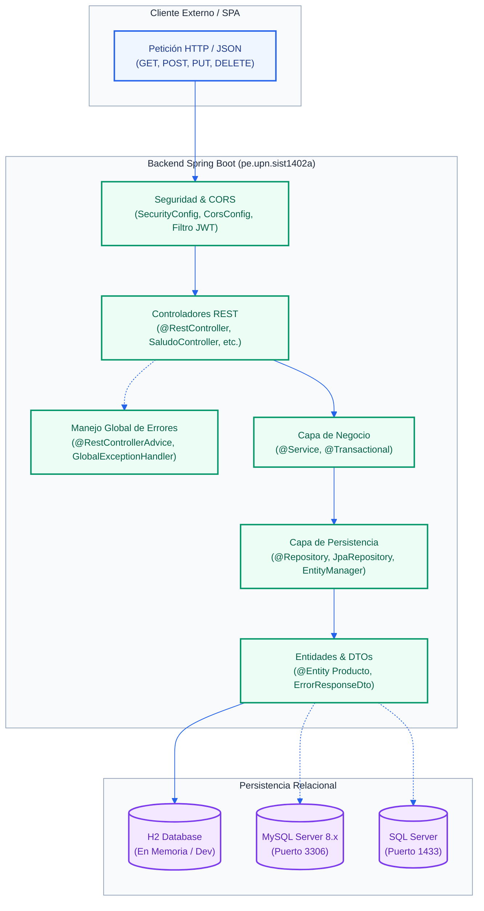
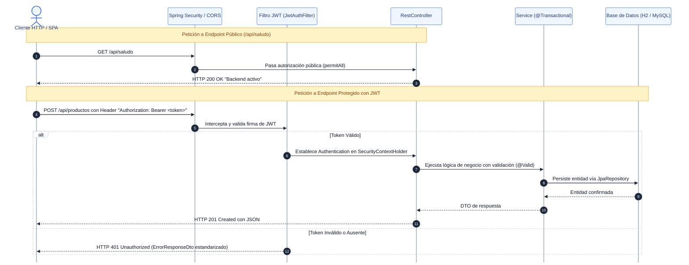

# AGENTS.md — Especificación Canónica y Directivas Técnicas del Backend (Spring Boot)

|Parámetro|Detalle|
|-|-|
|**Curso & Código**|Soluciones Web y Aplicaciones Distribuidas (SIST1402A) — 3 Créditos — Ciclo 8° / 9°|
|**Institución & Periodo**|Universidad Privada del Norte (UPN) — Facultad de Ingeniería — Periodo 2026-2|
|**Docente de Cátedra**|Ing. Mg. Carlos Alberto Ponte Ramírez|
|**Alineación Estratégica**|ODS 09: Industria, Innovación e Infraestructura|
|**Audiencia**|Google Jules, Antigravity CLI, Agentes Autónomos y Desarrolladores Backend|

---

## 1. Reglas Mandatarias de Ingeniería y Lista Blanca Estricta

1. **Lista Blanca Tecnológica Absoluta:** Queda terminantemente prohibido utilizar lenguajes, frameworks, librerías, dependencias en `pom.xml`, anotaciones o prácticas de programación distintas a las autorizadas en este documento y enseñadas en el curso. Cualquier elemento fuera de la lista blanca será rechazado.
2. **Respeto a la Progresión Didáctica por Semanas:**
   * **Semana 01:** Spring Web básico, arquitectura N-Capas (`controller`, `service`, `entity/dto`), Thymeleaf vs REST JSON. Endpoint inicial `/api/saludo` retornando `Backend activo`.
   * **Semana 02:** Endpoints GET/POST con almacenamiento en memoria (`List<T>`), separación estricta controller-service-model sin base de datos aún.
   * **Semana 03:** Persistencia relacional manual con `EntityManager` y clase `@Repository` (H2 / MySQL / SQL Server). **Prohibido terminantemente usar `JpaRepository` en Semana 03**.
   * **Semana 04:** Recién se autoriza `JpaRepository`, CRUD completo (GET, POST, PUT, DELETE), consultas JPQL parametrizadas obligatorias (`@Query`, `@Param`), `@NamedQuery` y `@Transient`. Prohibida la concatenación de strings en consultas SQL/JPQL.
   * **Semana 05:** Recién se autorizan Bean Validation (`spring-boot-starter-validation`), Spring Security (`spring-boot-starter-security`), emisión y validación de tokens JWT y control de CORS (`@CrossOrigin` / `CorsConfigurationSource`).
   * **Semana 11:** Paginación en servidor con `Pageable`, `PageRequest.of(...)` y retorno `Page<T>`, documentación viva con Swagger / OpenAPI 3 (`springdoc-openapi-starter-webmvc-ui` en `/swagger-ui/index.html`).
   * **Semana 12:** JPQL avanzado, relaciones multitabla, control transaccional atómico con `@Transactional(rollbackFor = Exception.class)` ubicado exclusivamente en la capa `@Service`.
   * **Semana 14:** Contraste REST vs SOAP, desacoplamiento hacia microservicios y empaquetado de producción (`./mvnw clean package`).
   * **Semana 15:** Despliegue en servidores distribuidos (Tomcat, WildFly, WebLogic) y encriptación de canal SSL/TLS (HTTPS).
3. **Cero Mocks Ciegos:** Todos los servicios, repositorios y controladores deben ser 100% deterministas y funcionales.
4. **Trazabilidad Obligatoria:** Todo commit, issue o PR debe referenciar su código funcional (ej. `[RF-SEM01-01]`, `[RF-SEM04-02]`).
5. **Respeto a Hitos Académicos:** Evolución incremental según el calendario: T1 (Sem 6), T2 (Sem 10), T3 (Sem 13) y Final (Sem 16).

---

## 2. Pila Tecnológica Oficial y Lista Blanca Backend

### 2.1. Dominio Tecnológico Autorizado

|Capa / Dominio|Tecnologías Oficiales Autorizadas por el Sílabo y Laboratorios|
|-|-|
|**Lenguaje & Entorno**|Java (JDK 17 LTS / JDK 21 LTS), Spring Boot 3.x, Maven con Maven Wrapper (`./mvnw`, `mvnw.cmd`).|
|**Persistencia / BD**|H2 Database (en memoria para desarrollo local), MySQL Server 8.x (puerto 3306), Microsoft SQL Server (puerto 1433), JPA, Hibernate, `EntityManager`, `@Repository`, `JpaRepository`, JPQL parametrizado, `@Transactional`.|
|**APIs y Protocolos**|RESTful APIs (JSON, HTTP GET/POST/PUT/DELETE, `ResponseEntity`), Servicios SOAP (WSDL/XML para interoperabilidad y contraste), CORS.|
|**Documentación API**|Swagger / OpenAPI 3 (`springdoc-openapi-starter-webmvc-ui` en `/swagger-ui/index.html` y `/v3/api-docs`).|
|**Seguridad Backend**|Spring Security 6, JWT (`io.jsonwebtoken:jjwt-api`, `jjwt-impl`, `jjwt-jackson`), BCryptPasswordEncoder, CORS.|
|**Validación**|Bean Validation API (`spring-boot-starter-validation`).|
|**Servidores / Despliegue**|Apache Tomcat (embebido en puerto 8080/8081 o standalone), Red Hat WildFly, Oracle WebLogic Server, Certificados SSL/TLS (HTTPS).|

### 2.2. Lista Blanca Estricta de Dependencias Maven (`pom.xml`)

* `org.springframework.boot:spring-boot-starter-web` (Spring MVC, REST, Jackson)
* `org.springframework.boot:spring-boot-starter-thymeleaf` (Vistas de servidor en `resources/templates/`)
* `org.springframework.boot:spring-boot-devtools` (Recarga en caliente para desarrollo)
* `org.springframework.boot:spring-boot-starter-data-jpa` (Hibernate, JPA, EntityManager)
* `com.h2database:h2` (Base de datos en memoria para pruebas locales)
* `com.mysql:mysql-connector-j` (Driver oficial para MySQL Server)
* `com.microsoft.sqlserver:mssql-jdbc` (Driver oficial para SQL Server)
* `org.springframework.boot:spring-boot-starter-validation` (Bean Validation API)
* `org.springframework.boot:spring-boot-starter-security` (Filtros de seguridad y autenticación)
* `io.jsonwebtoken:jjwt-api`, `jjwt-impl`, `jjwt-jackson` (Emisión y validación de tokens JWT)
* `org.springdoc:springdoc-openapi-starter-webmvc-ui` (Swagger UI interactivo)
* `org.projectlombok:lombok` (Generación de getters, setters, constructores y builders)
* `org.springframework.boot:spring-boot-starter-test` (JUnit 5, MockMvc, AssertJ)
* `org.springframework.security:spring-security-test` (Pruebas de seguridad)

### 2.3. Lista Blanca de Anotaciones Backend Permitidas

* **Configuración & Inicio:** `@SpringBootApplication`, `@Configuration`, `@Bean`, `@Value`.
* **Controladores Web/REST:** `@RestController`, `@Controller`, `@RequestMapping`, `@CrossOrigin(origins = "*")`, `@GetMapping`, `@PostMapping`, `@PutMapping`, `@DeleteMapping`, `@PathVariable`, `@RequestParam`, `@RequestBody`.
* **Manejo Global de Errores:** `@RestControllerAdvice`, `@ControllerAdvice`, `@ExceptionHandler`, `@ResponseStatus`.
* **Servicios & Transacciones:** `@Service`, `@Transactional(rollbackFor = Exception.class)`.
* **Persistencia & Entidades:** `@Repository`, `@PersistenceContext`, `@Entity`, `@Table(name = "...")`, `@Id`, `@GeneratedValue(strategy = GenerationType.IDENTITY)`, `@Column`, `@Transient`, `@Query`, `@Param`, `@NamedQuery`, `@Modifying`.
* **Validación de Datos:** `@Valid`, `@NotNull`, `@NotBlank`, `@NotEmpty`, `@Size`, `@Min`, `@Max`, `@Email`, `@DecimalMin`, `@DecimalMax`.
* **Documentación OpenAPI:** `@Tag`, `@Operation`, `@ApiResponse`, `@ApiResponses`.

---

## 3. Arquitectura del Backend

### 3.1. Arquitectura Lógica N-Capas



### 3.2. Flujo de Autenticación Stateless y Acceso a Endpoints Protegidos



---

## 4. Requerimientos Funcionales y Especificaciones Técnicas del Backend

### Unidad I: Introducción al Desarrollo Web, Procesos y Backend Inicial (Semanas 01 - 02)

|Sem / Código|Requerimiento Funcional y Alcance|Pila Técnica y Especificaciones de Clase|Criterio de Aceptación Determinista|
|:-:|-|-|-|
|**S01**<br>`RF-SEM01-01`<br>`SPEC-SEM01-A`|**Arquitectura Web y Configuración Backend Inicial:** Crear base Spring Boot cliente-servidor en N-capas (`controller`, `service`, `repository`, `entity`, `dto`, `exception`, `config`).|Spring Boot 3.x, Java 17/21 LTS, Maven Wrapper (`./mvnw`), `spring-boot-starter-web`, `spring-boot-devtools`. Group: `pe.upn.sist1402a`.|Compila con `./mvnw clean compile`, levanta en Tomcat puerto 8080 (`server.port=8080`). Endpoint `/api/saludo` responde `Backend activo`.|
|**S01**<br>`RF-SEM01-02`<br>`SPEC-SEM01-B`|**Vistas Tradicionales vs. REST Desacoplado:** Contrastar renderizado server-side HTML frente a API REST JSON.|`spring-boot-starter-thymeleaf`. Anotaciones: `@Controller` (devuelve vista `resources/templates/...`) vs `@RestController` (devuelve JSON).|Se evidencia la diferencia técnica: `@Controller` procesa plantilla con variables del modelo; `@RestController` emite JSON puro.|
|**S02**<br>`RF-SEM02-01`<br>`SPEC-SEM02-A`|**Modelado del Dominio del Negocio:** Delimitar flujos operativos y entidades del sistema Global Frío.|Dominio de Refrigeración y Climatización Comercial/Industrial. Entidad `Producto` o `Servicio`.|Especificación formal de clases de dominio y atributos técnicos requeridos.|
|**S02**<br>`RF-SEM02-02`<br>`SPEC-SEM02-B`|**Patrones GoF en Backend:** Implementar Singleton (Spring Services), Factory, Decorador y Repository (abstracción).|Java POO, Patrones GoF, `@Service`, separación estricta controller-service-model.|Separación de responsabilidades clara sin acoplamiento; servicios coordinan la lógica.|
|**S02**<br>`RF-SEM02-03`<br>`SPEC-SEM02-C`|**Endpoints GET y POST en Memoria:** Gestión de entidades con almacenamiento en memoria sin base de datos aún.|`spring-boot-starter-web`. Anotaciones: `@RestController`, `@RequestMapping("/api/...")`, `@CrossOrigin(origins = "*")`, `@GetMapping`, `@PostMapping`, `@RequestBody`, `@PathVariable`.|Endpoints operan con `List<T>` en memoria (`filter`, `findFirst`), retornando `ResponseEntity.ok()`, `201 Created` y `404 Not Found`.|

---

### Unidad II: Backend con Spring Boot, Persistencia y Seguridad (Semanas 03 - 06)

|Sem / Código|Requerimiento Funcional y Alcance|Pila Técnica y Especificaciones de Clase|Criterio de Aceptación Determinista|
|:-:|-|-|-|
|**S03**<br>`RF-SEM03-01`<br>`SPEC-SEM03-A`|**Diseño Técnico de API REST bajo Enfoque PMI:** Fundamentar la API con alcance, EDT/WBS y contratos de endpoints.|PMI / PMBOK, REST API Design. Criterio de aceptación: los datos sobreviven al reinicio de la aplicación.|Matriz de trazabilidad entre entregables EDT y firmas de controladores REST.|
|**S03**<br>`RF-SEM03-02`<br>`SPEC-SEM03-B`|**Persistencia JPA con EntityManager (Regla: Sin JpaRepository):** Conexión relacional y mapeo de entidades.|`spring-boot-starter-data-jpa`, H2 / MySQL. Anotaciones: `@Entity`, `@Table`, `@Id`, `@GeneratedValue(strategy = GenerationType.IDENTITY)`, `@Column`. Clase `@Repository` con `@PersistenceContext EntityManager entityManager`.|**Prohibido terminantemente JpaRepository en S03**. Inserción con `entityManager.persist()` y consulta con `entityManager.createQuery()`.|
|**S04**<br>`RF-SEM04-01`<br>`SPEC-SEM04-A`|**Gestión Ágil (Scrum):** Product Backlog de incremento, Sprints y criterios de Definition of Done (DoD).|Metodologías Ágiles, Scrum, User Stories con Criterios de Aceptación verificables.|Backlog estructurado con tareas asignadas y criterios de aceptación claros.|
|**S04**<br>`RF-SEM04-02`<br>`SPEC-SEM04-B`|**CRUD Integral con JpaRepository:** Operaciones completas de lectura, creación, edición y borrado.|`public interface ProductoRepository extends JpaRepository<Producto, Long>`. Métodos derivados (`findByNombreContainingIgnoreCase`).|Métodos CRUD (`findAll`, `findById`, `save`, `deleteById`, `existsById`) operan sobre base de datos relacional.|
|**S04**<br>`RF-SEM04-03`<br>`SPEC-SEM04-C`|**JPQL Parametrizado, Named Queries y Mitigación SQLi:** Consultas seguras y campos calculados.|`@Query("SELECT p FROM Producto p WHERE p.precio BETWEEN :minimo AND :maximo")`, `@Param`, `@NamedQuery`, `@Transient`.|**Prohibida la concatenación de cadenas en JPQL**. Uso obligatorio de parámetros `:param`. `@Transient` en `estadoStock`.|
|**S05**<br>`RF-SEM05-01`<br>`SPEC-SEM05-A`|**Endpoints REST Estandarizados y Validación Backend:** Controladores completos con Bean Validation.|`spring-boot-starter-validation`. Anotaciones: `@Valid`, `@NotBlank`, `@NotNull`, `@Size`, `@Min`, `@Max`. Manejo global con `@RestControllerAdvice`.|Validación automática; respuestas con status 200, 201, 204, 400 Bad Request con mensaje descriptivo.|
|**S05**<br>`RF-SEM05-02`<br>`SPEC-SEM05-B`|**Seguridad con Spring Security y JWT:** Emisión y validación stateless de tokens de autenticación.|`spring-boot-starter-security`, JJWT (`jjwt-api`, `jjwt-impl`, `jjwt-jackson`). Ruta pública `/api/auth/login`; recursos protegidos con cabecera `Authorization: Bearer <token>`.|Peticiones no autorizadas retornan 401 Unauthorized / 403 Forbidden; tokens válidos permiten acceso.|
|**S05**<br>`RF-SEM05-03`<br>`SPEC-SEM05-C`|**Control de Políticas CORS para Angular:** Habilitar consumo seguro desde el cliente SPA.|Spring Security CORS (`@CrossOrigin(origins = "http://localhost:4200")` o `CorsConfigurationSource`).|Pre-flight `OPTIONS` exitoso admitiendo verbos HTTP y encabezados `Authorization`, `Content-Type`.|
|**S06**<br>`RF-SEM06-01`<br>`SPEC-SEM06-A`|**Consolidación Backend — Evaluación T1 (10%):** Integración completa de API REST, JPA, validaciones y pruebas.|Spring Boot, Spring Data JPA, Spring Security, cURL / Postman (`curl.exe -i http://localhost:8080/api/...`).|Casos de prueba ejecutados satisfactoriamente con persistencia real y seguridad demostrada.|
|**S06**<br>`RF-SEM06-02`<br>`SPEC-SEM06-B`|**Alineación con ODS 9:** Documentar automatización e infraestructura tecnológica sostenible.|ODS 09 (Industria, Innovación e Infraestructura). Caso: Eficiencia energética en refrigeración y control de stock.|Evidencia técnica que justifica la automatización de procesos y optimización de recursos.|

---

### Unidad III: Paginación en Servidor y Documentación Interactiva (Semanas 11)

|Sem / Código|Requerimiento Funcional y Alcance|Pila Técnica y Especificaciones de Clase|Criterio de Aceptación Determinista|
|:-:|-|-|-|
|**S11**<br>`RF-SEM11-01`<br>`SPEC-SEM11-A`|**Paginación en Servidor:** Consultas optimizadas con metadatos de paginación y ordenamiento.|`org.springframework.data.domain.Pageable`, `PageRequest.of(page, size, sort)`, retorno `Page<T>`.|El servidor envía subconjuntos paginados de datos con `totalElements`, `totalPages` y `content`.|
|**S11**<br>`RF-SEM11-02`<br>`SPEC-SEM11-B`|**Documentación Interactiva con Swagger / OpenAPI 3:** Documentación viva del contrato REST.|`springdoc-openapi-starter-webmvc-ui`. Acceso en `/swagger-ui/index.html` y `/v3/api-docs`.|Swagger UI expone esquemas, DTOs, códigos HTTP de respuesta y consola de prueba interactiva con JWT.|

---

### Unidad IV: Transacciones Avanzadas, SOA y Despliegue Distribuido (Semanas 12 - 16)

|Sem / Código|Requerimiento Funcional y Alcance|Pila Técnica y Especificaciones de Clase|Criterio de Aceptación Determinista|
|:-:|-|-|-|
|**S12**<br>`RF-SEM12-01`<br>`SPEC-SEM12-A`|**JPQL Avanzado con Parámetros Nombrados:** Consultas complejas con filtros dinámicos y agregación.|JPQL con `@Query`, `@Param("param")`, consultas sobre relaciones `@ManyToOne`/`@OneToMany`.|Consultas optimizadas y totalmente blindadas contra inyecciones SQL.|
|**S12**<br>`RF-SEM12-02`<br>`SPEC-SEM12-B`|**Control Transaccional y Políticas de Rollback:** Gestión atómica de operaciones multitabla.|`@Transactional(rollbackFor = Exception.class)` ubicado exclusivamente en la capa `@Service`.|Comprobación de atomicidad (ACID): ante fallo en una operación secundaria, se revierte todo cambio en la BD.|
|**S12**<br>`RF-SEM12-03`<br>`SPEC-SEM12-C`|**Arquitectura Orientada a Servicios (SOA):** Estructurar contratos desacoplados e interoperables.|SOA, contratos e interfaces de negocio estandarizadas.|Servicios desacoplados con interfaces formalmente definidas y formatos de intercambio estándar.|
|**S13**<br>`RF-SEM13-01`<br>`SPEC-SEM13-A`|**Consolidación Transaccional — Evaluación T3 (30%):** Sustentación de caso transaccional con autonomía.|Spring Boot Transaccional + SGBD Relacional.|Demostración de escenarios exitosos y escenarios de excepción con reversión automática comprobada.|
|**S14**<br>`RF-SEM14-01`<br>`SPEC-SEM14-A`|**Interoperabilidad: Contraste REST vs. SOAP:** Comparación formal entre estilos arquitectónicos.|REST (JSON, ligero, CRUD) vs. SOAP (XML, WSDL, contratos estrictos).|Demostración de consumo y contraste bajo estándares formales.|
|**S14**<br>`RF-SEM14-02`<br>`SPEC-SEM14-B`|**Desacoplamiento hacia Microservicios:** Preparación de servicios modulares autónomos.|Microservicios, principios de arquitectura distribuida.|Módulos desacoplados capaces de ejecutarse independientemente.|
|**S14**<br>`RF-SEM14-03`<br>`SPEC-SEM14-C`|**Empaquetado de Artefactos para Producción:** Generación de compilados optimizados.|Backend: `./mvnw clean package` (genera archivo ejecutable `.jar` en `target/`).|Artefacto ejecutable autónomo generado sin errores de compilación.|
|**S15**<br>`RF-SEM15-01`<br>`SPEC-SEM15-A`|**Despliegue en Servidores Distribuidos:** Puesta en marcha en entornos empresariales.|Apache Tomcat (standalone o embebido), Red Hat WildFly o Oracle WebLogic. Ejecución: `java -jar target/*.jar`.|Aplicación activa y accesible atendiendo peticiones concurrentes.|
|**S15**<br>`RF-SEM15-02`<br>`SPEC-SEM15-B`|**Seguridad Web y Certificados SSL/TLS:** Encriptación de canal de transporte (HTTPS).|Certificados SSL/TLS, configuración `server.ssl.*` en `application.properties`.|Navegación obligatoria bajo `https://` con cifrado activo.|
|**S15**<br>`RF-SEM15-03`<br>`SPEC-SEM15-C`|**Infraestructura Tecnológica Sostenible (ODS 9):** Documentar dimensionamiento y uso de recursos.|ODS 09 (Meta 9.4: adopción de tecnologías limpias).|Justificación técnica del dimensionamiento de cómputo, memoria y red.|
|**S16**<br>`RF-SEM16-01`<br>`SPEC-SEM16-A`|**Sustentación Integral del Proyecto Final (40%):** Defensa y demostración en vivo del backend completo.|Spring Boot + Base de Datos + JWT + Swagger + Rollback + SSL + ODS 9.|Demostración completa de flujos, sustentación de arquitectura y código.|

---

## 5. Matriz de Trazabilidad y Hitos de Evaluación del Backend

|Evaluación|Semana|Peso|Alcance Técnico Backend Evaluado|Requerimientos Clave|
|:-:|:-:|:-:|-|-|
|**T1**|Semana 06|**10%**|Backend funcional: API REST, persistencia JPA, validaciones, seguridad básica y ODS 9.|`RF-SEM01-01` a `RF-SEM06-02`|
|**T2**|Semana 10|**20%**|Integración con cliente Angular, endpoints de soporte, autenticación JWT y CORS.|`RF-SEM05-02`, `RF-SEM05-03`, `RF-SEM09-01`|
|**T3**|Semana 13|**30%**|Persistencia avanzada: JPQL parametrizado, `@Transactional`, Rollback, SOA e interoperabilidad.|`RF-SEM11-01` a `RF-SEM13-01`|
|**Evaluación Final**|Semana 16|**40%**|Proyecto distribuido integral con SSL, empaquetado producción, Swagger y ODS 9.|`RF-SEM14-01` a `RF-SEM16-01`|
|**Sustitutorio**|—|**0%**|**NO APLICA EVALUACIÓN SUSTITUTORIA** según resolución oficial de facultad.|N/A|

---

## 6. Estructura de Directorios del Backend

```text
backend/
├── AGENTS.md                               <- Especificación canónica y directivas técnicas del backend
├── pom.xml                                 <- Descriptor Maven con dependencias de la lista blanca
├── mvnw                                    <- Maven Wrapper script para entornos Unix / Linux / macOS
├── mvnw.cmd                                <- Maven Wrapper script para Windows
├── .mvn/
│   └── wrapper/
│       ├── maven-wrapper.jar
│       └── maven-wrapper.properties        <- Versión oficial Maven 3.9.9
│
├── src/
│   ├── main/
│   │   ├── java/pe/upn/sist1402a/
│   │   │   ├── GlobalfrioApplication.java  <- Clase principal @SpringBootApplication
│   │   │   ├── config/                     <- SecurityConfig, CorsConfig, OpenApiConfig
│   │   │   ├── controller/                 <- @RestController (SaludoController, etc.)
│   │   │   ├── service/                    <- Interfaces de servicio (@Service)
│   │   │   │   └── impl/                   <- Implementaciones de servicio
│   │   │   ├── repository/                 <- Interfaces JpaRepository / DAO EntityManager
│   │   │   ├── entity/                     <- Entidades @Entity mapeadas a BD (Producto, etc.)
│   │   │   ├── dto/                        <- DTOs (ErrorResponseDto, SaludoResponseDto, etc.)
│   │   │   └── exception/                  <- @RestControllerAdvice y excepciones personalizadas
│   │   └── resources/
│   │       ├── application.properties      <- Conexión H2/MySQL/SQL Server, puerto 8080, Swagger
│   │       └── templates/                  <- Plantillas Thymeleaf de servidor (Semana 01)
│   └── test/
│       └── java/pe/upn/sist1402a/
│           └── GlobalfrioApplicationTests.java <- Pruebas automatizadas de contexto, salud y errores
```

---

## 7. Directivas Operativas Específicas para Agentes Inteligentes y Jules

1. **Revisión Obligatoria de la Lista Blanca:** Antes de escribir una sola línea de código, verificar que toda anotación, dependencia o clase pertenezca a la lista blanca oficial de la Sección 2. Rechazar cualquier librería externa no autorizada.
2. **Respeto a la Regla de Progresión:** En Semana 3 bajo ninguna circunstancia emplear `JpaRepository` (usar `EntityManager`); en Semana 4 recién incorporar `JpaRepository` y consultas con parámetros nombrados `:param`.
3. **Manejo Global de Excepciones:** Todo error capturado por `@RestControllerAdvice` debe retornar obligatoriamente la siguiente estructura canónica:

```json
{
  "timestamp": "2026-09-16T23:00:00Z",
  "status": 400,
  "error": "Bad Request",
  "message": "Descripción clara del error de validación o causa",
  "path": "/api/recurso"
}
```

4. **Seguridad en Persistencia:** Prohibida terminantemente la concatenación de variables en JPQL (`"WHERE p.nombre = '" + nombre + "'"`). Obligatorio usar parámetros con nombre (`:nombre`) y `@Param`.
5. **Transaccionalidad en Servicios:** La anotación `@Transactional(rollbackFor = Exception.class)` debe situarse **únicamente** en la capa `@Service`, nunca en controladores ni repositorios.
6. **Formato Convencional de Commits:**
   * `feat(backend): [RF-SEM01-01] configurar arquitectura Spring Boot y endpoint /api/saludo`
   * `feat(backend): [RF-SEM04-02] implementar JpaRepository para ProductoRepository`
   * `sec(auth): [RF-SEM05-02] configurar filtro de validación JWT en Spring Security`
   * `fix(exception): [SPEC-SEM05-A] estandarizar respuestas de error en GlobalExceptionHandler`
